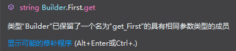

[原文地址：http://www.abhisheksur.com/2010/10/dlr-using-reflectionemit-in-depth-part_24.html]()

上节我们讨论了如何在运行时新建自己的程序集（Assembly）。这节我将给一些例子让你更好的理解在运行时怎么去构建自定义类。我也会覆盖讲到 MSIL 的相关概念，以便你能更容易的在你的应用程序中运用 MSIL。

## 基础概要

构建动态类型最重要的事就是我们之前讨论要早先构建一个类。BCL 向外暴露了类构造器（XXXBuilder），它能够构建 IL 生成器能让你在运行期间编写 IL 指令，因此你可以在编译跟输出同样的程序。


上图我放了一些重要的构造器类并标记了红色。最后，你需要指令它在应用程序中运行。为了写 IL 表达式，Reflection.Emit 提供了一个类叫 ILGenerator。ILGenerator（我标记为蓝色）能够让你编写自己的属性及方法的 IL 代码。OPcodes 是操作代码，它执行 CPU 的指令。所以我们在指令的时候，需要传递这些 Opcodes 以及为方法生成指令。

现在让我们一起看看这个例子，让我来一行行的代码来距离，让你更容易的构建自己的代码生成器。

## 实现程序集的 IBuilder

先转移到 IBuilder 接口的实现类。之前我们讨论过了，IBuilder 包含四个成员，Sum，Divide，Multiply 和 Substract。

```c#
public interface IBuilder 
{
    float Sum(int firstNum, int secondNum);
    float Substract(int firstnum, int secondnum);
    float Multiply(int firstnum, int secondnum);
    float Divide(int firstnum, int secondnum);
}
```

现在让我们来转成 IL 代码，用 Visual Studio 自带的工具 ILDASM 就能很清楚的看出 IL 代码，这样我们就去实现跟这个一样的就行了。

之后我构建出来并且打开 ILDASM 反编译我的程序集，它的 IL 就像下面这样

```c#
.class interface public abstract auto ansi ReflectionEmitGuider.IBuilder
{
    .method public hidebysig newslot abstract virtual 
            instance float32  Divide(int32 firstnum,
                                     int32 secondnum) cil managed
    {
    } // end of method IBuilder::Divide
    .method public hidebysig newslot abstract virtual 
            instance float32  Multiply(int32 firstnum,
                                       int32 secondnum) cil managed
    {
    }
    .method public hidebysig newslot abstract virtual 
        instance float32  Substract(int32 firstnum,
                                    int32 secondnum) cil managed
    {
    }
    .method public hidebysig newslot abstract virtual 
            instance float32  Sum(int32 firstnum,
                                  int32 secondnum) cil managed
    {
    }
}
```

让我来解释一些这些 IL。

- 在 MSIL 中，任何类型在定义时都会伴随 .class 前缀，所以我们在构造类型构造器类的时候就会有一个 .class
- interface，abstract 关键字标识着这个类是抽象的，所以你不能创建于这个相同的类。
- auto 指定自动解释的 LPSTR（字符串的长指针）
- ansi 指定作为 ANSI 解释的 LPSTR
- 方法在 Builder 中是用 .method 关键字标识的
- 因为作为接口的成员，方法会自动被赋值为 abstract virtual
- 方法不是静态的，所以它在 MSIL 中用 instance 关键字定义
- hidebysig 指定方法能够通过名字和前面隐藏。你在 .NET 中定义的任何普通的方法都可以获得这种灵活性。
- newslot 标记成员在虚表（vtable）中获取一个槽位（slot）。（vtable 是这个整个对象的一个内存区域，所以无论什么时候一个对象被创建，这个虚表就会为每个对象创建一个 vtable，并且在其中创建任何对象都会获得 vtable 的一个条目）。第一个成员是隐藏指针，可以用来查找 vtable 的成员。
- cil managed 是用来确定方法是在托管环境中被实现。

现在你理解接口生成的 IL 了，是时候通过它来生成 TypeBuilder 了，来看看下面的代码

```c#
private Type CreateIBuilder(ModuleBuilder mbuilder)
{

    TypeBuilder tbuilder = mbuilder.DefineType("IBuilder", TypeAttributes.Interface | 
        TypeAttributes.Public | 
        TypeAttributes.Abstract | 
        TypeAttributes.AutoClass | 
        TypeAttributes.AnsiClass);

    //Define Divide
    Type[] tparams = { typeof(System.Int32), typeof(System.Int32) };
    MethodBuilder metDivide = tbuilder.DefineMethod("Divide", MethodAttributes.Public | 
        MethodAttributes.Abstract | 
        MethodAttributes.Virtual |
        MethodAttributes.HideBySig | 
        MethodAttributes.NewSlot, 
        CallingConventions.HasThis, 
        typeof(System.Single), tparams);
    metDivide.SetImplementationFlags(MethodImplAttributes.Managed);

    MethodBuilder metSum = tbuilder.DefineMethod("Sum", MethodAttributes.Public |
        MethodAttributes.Abstract |
        MethodAttributes.Virtual |
        MethodAttributes.HideBySig |
        MethodAttributes.NewSlot,
        CallingConventions.HasThis,
        typeof(System.Single), tparams);
    metSum.SetImplementationFlags(MethodImplAttributes.Managed);

    MethodBuilder metMultiply = tbuilder.DefineMethod("Multiply", MethodAttributes.Public |
        MethodAttributes.Abstract |
        MethodAttributes.Virtual |
        MethodAttributes.HideBySig |
        MethodAttributes.NewSlot,
        CallingConventions.HasThis,
        typeof(System.Single), tparams);
    metMultiply.SetImplementationFlags(MethodImplAttributes.Managed);

    MethodBuilder metSubstract = tbuilder.DefineMethod("Substract", MethodAttributes.Public |
        MethodAttributes.Abstract |
        MethodAttributes.Virtual |
        MethodAttributes.HideBySig |
        MethodAttributes.NewSlot,
        CallingConventions.HasThis,
        typeof(System.Single), tparams);
    metSubstract.SetImplementationFlags(MethodImplAttributes.Managed);

    Type tIBuilder = tbuilder.CreateType();


    return tIBuilder;
}
```

在上面的代码首先我们从 ModuleBuilder.DefineType 新建 TypeBuilder。你应该注意到了，我在构建的时候我往 TypeAttributes 参数传了与 IL 代码一样的值。在新建 TypeBuilder 之后，我们就该添加方法了。DefineMethod 方法能帮助我们正确构建方法，对此我们还要传递 MethodAttributes 参数值。CallingConversion.HasThis 将会使这个方法成为一个实例方法。我们还需注意它返回的类型 ReturnType 以及指定的参数类型。在这个例子中，我指定返回的类型是整数型 System.Single。我们还要使用 SetImplementationFlags 来指定方法是托管方法。

最后我们就可以调用 TypeBuilder.CreateType 来获得实际的类型了。

## 创建 Builder 类

现在时候解决最后的事了。首先我用方法新建一个基本类，这个必须要求是要实现 IBuilder，然后我们将添加委托，事件，新的方法，静态方法等等。

为创建 Builder 类，首先要做的事就是我们需要构造函数器。但是我们的构造函数需要少许行来初始化属性 FirstNum 和 SecondNum，首先我们来定义它们。

### 1. 实现类

我们先来实现 TypeBuilder 然后去定义字段和属性

```c#
.class public auto ansi beforefieldinit EmitMethodSample.Builder
    extends [mscorlib]System.Object
    implements EmitMethodSample.IBuilder
{
}
```

这个类拓展了 System.Object 并且实现了 IBuilder 类。

我认为，使用 TypeBuilder 构造类应该更容易，我来在构建一次

```c#
Type[] interfaces = { parentBuilder };
TypeBuilder tbuilder = mbuilder.DefineType("Builder", TypeAttributes.Public |
    TypeAttributes.AutoClass |
    TypeAttributes.AnsiClass |
    TypeAttributes.BeforeFieldInit,
    typeof(System.Object),
    interfaces);
```

这部分在代码中，我从 parentBuilder 实现了 Builder，它（parentBuilder ）是 IBuilder 接口类型的。如果你注意看这些代码，就看到我为这个类型指定了 BeforeFieldInit，意思就是说你可以在这个对象未初始化的时候调用静态成员信息。我也可以根据 IL 来实现继承自 System.Object 的类。

### 2. 实现字段和属性

我们准备好了类型，现在就让我们添加一些字段和属性吧。

添加的字段和属性就像下面这段实际代码一样

```c#
private int firstNum, secondNum;
public int FirstNum
{
    get { return this.firstNum; }
    set { this.firstNum = value; }
}

public int SecondNum
{
    get { return this.secondNum; }
    set { this.secondNum = value; }
}
```

现在让我们看 FirstNum 属性的 IL 代码：

```c#
.field private int32 firstNum
.property instance int32 FirstNum()
{
  .get instance int32 ReflectionEmitGuider.Builder::get_FirstNum()
  .set instance void ReflectionEmitGuider.Builder::set_FirstNum(int32)
}
.method public hidebysig newslot specialname virtual final 
        instance int32  get_FirstNum() cil managed
{
  // Code size       12 (0xc)
  .maxstack  1
  .locals init (int32 V_0)
  IL_0000:  nop
  IL_0001:  ldarg.0
  IL_0002:  ldfld      int32 ReflectionEmitGuider.Builder::firstNum
  IL_0007:  stloc.0
  IL_0008:  br.s       IL_000a
  IL_000a:  ldloc.0
  IL_000b:  ret
}
.method public hidebysig specialname instance void 
        set_FirstNum(int32 'value') cil managed
{
  // Code size       9 (0x9)
  .maxstack  8
  IL_0000:  nop
  IL_0001:  ldarg.0
  IL_0002:  ldarg.1
  IL_0003:  stfld      int32 ReflectionEmitGuider.Builder::firstNum
  IL_0008:  ret
}
```

从 IL 代码内容来看，属性是被包装成了两个方法，get_PropertyName，它是返回属性值的 和 set_PropertyName ，它是给属性赋值的。

那么根据这里的 IL 代码，我们可以 “依葫芦画瓢” 来编写 IL 指令。

```c#
FieldBuilder fFirst = tbuilder.DefineField("firstNum", typeof(System.Int32), FieldAttributes.Private);
PropertyBuilder pFirst = tbuilder.DefineProperty("FirstNum", PropertyAttributes.HasDefault, typeof(System.Int32), null);
//Getter
MethodBuilder mFirstGet = tbuilder.DefineMethod("get_FirstNum", MethodAttributes.Public | 
    MethodAttributes.SpecialName | 
    MethodAttributes.HideBySig, typeof(System.Int32), Type.EmptyTypes);
ILGenerator firstGetIL = mFirstGet.GetILGenerator();

firstGetIL.Emit(OpCodes.Ldarg_0);
firstGetIL.Emit(OpCodes.Ldfld, fFirst);
firstGetIL.Emit(OpCodes.Ret);

//Setter
MethodBuilder mFirstSet = tbuilder.DefineMethod("set_FirstNum", MethodAttributes.Public |
    MethodAttributes.SpecialName |
    MethodAttributes.HideBySig, null, new Type[] { typeof(System.Int32) });

ILGenerator firstSetIL = mFirstSet.GetILGenerator();

firstSetIL.Emit(OpCodes.Ldarg_0);
firstSetIL.Emit(OpCodes.Ldarg_1);
firstSetIL.Emit(OpCodes.Stfld, fFirst);
firstSetIL.Emit(OpCodes.Ret);

pFirst.SetGetMethod(mFirstGet);
pFirst.SetSetMethod(mFirstSet);
```

太大了，让我来解释一下。首先我添加一个私有的 firstNum 整型字段。FieldBuilder 会帮助你添加字段到 IL。为了定义属性，首先需要定义属性自身并且你必须定义两个方法，一个是 Getter，另一个是 Setter，前者返回一个 int 结果，后者需要 int 参数。

Opcodes 提供设置表达式的入口。**ldarg** 加载参数，**Ldfdl** 以及 **Stfld** 加载以及赋值那些字段值到字段上。

你现在必须要理解，一个属性实际上回装换成相同签名的 get_Property，set_Property 方法。换成 C# 代码就是如下。

```c#
private string first;
public string First { get { return this.first; } set { this.first = value; } }

public string get_First()
{
    return this.first;
}
public void set_First(string value)
{
    this.first = value;
}
```

上面的代码不会编译的，因为 get_First 和 set_First 被编译器发现其实他们早就存在了。



### 3. 实现构造函数

如果你的类中没有定义构造函数，C# 编译器默认会自动给你增加一个无参的构造函数。它是如何做到的？实际上对任何类，这个默认的构造函数是自动继承的 System.Object 的，因此你不需要在你定义的类中增加构造器。只有当它被你以显式方式定义的时候，它会写到 IL 中去。

回我们的例子，我显式的申明了一个带参的构造器。

```c#
public Builder(int firstnum, int secondnum)
{
    this.FirstNum = firstnum;
    this.SecondNum = secondnum;
}
```

让我们来快速看下构造器转换成 IL 是什么样子的。

```c#
.method public hidebysig specialname rtspecialname 
        instance void  .ctor(int32 firstnum,
                             int32 secondnum) cil managed
{
  // Code size       25 (0x19)
  .maxstack  8
  IL_0000:  ldarg.0
  IL_0001:  call       instance void [System.Runtime]System.Object::.ctor()
  IL_0006:  nop
  IL_0007:  nop
  IL_0008:  ldarg.0
  IL_0009:  ldarg.1
  IL_000a:  call       instance void ReflectionEmitGuider.Builder::set_FirstNum(int32)
  IL_000f:  nop
  IL_0010:  ldarg.0
  IL_0011:  ldarg.2
  IL_0012:  call       instance void ReflectionEmitGuider.Builder::set_SecondNum(int32)
  IL_0017:  nop
  IL_0018:  ret
}
```

构建一个构造器，我们需要创建 ConstructorBuilder 对象，它可以从 TypeBuilder 类的方法 DefineConstructor 获取。如果你看了 IL，**你就知道，IL 实际上第一次内部先调用了 System.Object 的无参构造器。这是必然的，任何继承自基类 System.Object 的对象是如此。**

```c#
.method public hidebysig specialname rtspecialname 
        instance void  .ctor() cil managed
{
  // Code size       25 (0x19)
  .maxstack  8
  IL_0000:  ldarg.0
  IL_0001:  call       instance void [System.Runtime]System.Object::.ctor()
  IL_0006:  nop
  IL_0007:  nop
  IL_0008:  ldarg.0
  IL_0009:  ldc.i4.0
  IL_000a:  call       instance void ReflectionEmitGuider.Builder::set_FirstNum(int32)
  IL_000f:  nop
  IL_0010:  ldarg.0
  IL_0011:  ldc.i4.0
  IL_0012:  call       instance void ReflectionEmitGuider.Builder::set_SecondNum(int32)
  IL_0017:  nop
  IL_0018:  ret
}
```

这个类的两个方法 set_FirstNum 以及 set_SencondNum 在 IL 调用去赋值给 FirstNum 以及 SecondNum。

```c#
Type[] parameters = { typeof(System.Int32), typeof(System.Int32) };
ConstructorBuilder cBuilder = tbuilder.DefineConstructor(MethodAttributes.Public | 
    MethodAttributes.HideBySig | 
    MethodAttributes.SpecialName | 
    MethodAttributes.RTSpecialName, 
    CallingConventions.Standard, 
    parameters);

ConstructorInfo conObj = typeof(object).GetConstructor(new Type[0]);

ILGenerator cil = cBuilder.GetILGenerator();
cil.Emit(OpCodes.Ldarg_0);
cil.Emit(OpCodes.Call, conObj);
cil.Emit(OpCodes.Nop);
cil.Emit(OpCodes.Nop);
cil.Emit(OpCodes.Ldarg_0);
cil.Emit(OpCodes.Ldarg_1);
cil.Emit(OpCodes.Call, mFirstSet);
cil.Emit(OpCodes.Nop);
cil.Emit(OpCodes.Ldarg_0);
cil.Emit(OpCodes.Ldarg_1);
cil.Emit(OpCodes.Call, mSecondSet);
cil.Emit(OpCodes.Nop);
cil.Emit(OpCodes.Nop);
cil.Emit(OpCodes.Ret);
```

MethodAttribute.SpecialName 来修饰构造器，是让方法在 CLR 中特殊。因此，方法 ctor 能够使它成为类型的构造器。

调用 System.Object 的构造器，我们需要追踪它的构造器。我使用反射从 Type 获取 Constructorinfo 并把它传递进去来调用 Opcodes。我们发出 IL 中指定的代码，因此构造器就会被生成。

有趣的是要记住 Reflection.Emit，它内部发送了一个隐藏对象给调用的每个方法。这个隐式对象就是我们平常用的标识，如在 C# 中的 "this"，或 VB 中的 “ME”。因此当我们调用 Opcodes.Ldarg_0 指令时，我们实际上会隐式的把对象作为第一个参数传递构造器中。所以我们开始指定的任何参数，都是从下标 1 开始的。

Constructor 和 普通方法唯一不同的点是，Constructor 不会返回值。在 CLR，如果你调用了 Opcodes.Ret，方法会返回栈顶元素。所以你得在调用 Ret 之前，加载了一个值到堆栈中，那么当你调用 TypeBuilder.CreateType 方法时，你将会出现 “Invalid Program” 的异常。所以在这个例子中，在调用 Ret 之前你应该调用 Nop。

现在我们已经定义了构造方法，让我们转移目标到方法定义上吧。

### 4. 实现 IBuilder 的方法

现在我们的构造函数已经准备好了，是时候实现 IBuilder 对象的那些那些方法了。通过代码，会更加让你清楚怎么去构建自己自定义对象。让我们来实现 IBuilder 类的方法 Divide 吧。

首先我们还是看原来的 Divide 方法。

```c#
public float Divide(int firstnum, int secondnum)
{
    try
    {
        return firstnum / secondnum;
    }
    catch (DivideByZeroException ex)
    {
        Console.WriteLine("ZeroDivide exception : {0}", ex.Message);
        return 0;
    }
}
```

毫无疑问继续用 ILDASM 反编译 Divide 方法：

```c#
.method public hidebysig newslot virtual final 
        instance float32  Divide(int32 firstnum,
                                 int32 secondnum) cil managed
{
  // Code size       38 (0x26)
  .maxstack  2
  .locals init (float32 V_0,
           class [System.Runtime]System.DivideByZeroException V_1)
  IL_0000:  nop
  .try
  {
    IL_0001:  nop
    IL_0002:  ldarg.1
    IL_0003:  ldarg.2
    IL_0004:  div
    IL_0005:  conv.r4
    IL_0006:  stloc.0
    IL_0007:  leave.s    IL_0024
  }  // end .try
  catch [System.Runtime]System.DivideByZeroException 
  {
    IL_0009:  stloc.1
    IL_000a:  nop
    IL_000b:  ldstr      "ZeroDivide exception : {0}"
    IL_0010:  ldloc.1
    IL_0011:  callvirt   instance string [System.Runtime]System.Exception::get_Message()
    IL_0016:  call       void [System.Console]System.Console::WriteLine(string,
                                                                        object)
    IL_001b:  nop
    IL_001c:  ldc.r4     0.0
    IL_0021:  stloc.0
    IL_0022:  leave.s    IL_0024
  }  // end handler
  IL_0024:  ldloc.0
  IL_0025:  ret
}
```

跟之前的 IL 代码比，唯一不同的就是 try/catch 块。所以我们来实现 try/catch 块的代码。

```c#
MethodBuilder mDivide = tbuilder.DefineMethod("Divide", MethodAttributes.Public |
    MethodAttributes.HideBySig |
    MethodAttributes.NewSlot |
    MethodAttributes.Virtual |
    MethodAttributes.Final,
    CallingConventions.Standard,
    typeof(System.Single),
    new Type[] { typeof(System.Int32), typeof(System.Int32) });
mDivide.SetImplementationFlags(MethodImplAttributes.Managed);
ILGenerator dil = mDivide.GetILGenerator();

dil.Emit(OpCodes.Nop);
Label lblTry = dil.BeginExceptionBlock();

dil.Emit(OpCodes.Nop);
dil.Emit(OpCodes.Ldarg_1);
dil.Emit(OpCodes.Ldarg_2);
dil.Emit(OpCodes.Div);
dil.Emit(OpCodes.Conv_R4); // Converts to Float32
dil.Emit(OpCodes.Stloc_1);
dil.Emit(OpCodes.Leave, lblTry);

dil.BeginCatchBlock(typeof(DivideByZeroException));
dil.Emit(OpCodes.Stloc_0);
dil.Emit(OpCodes.Nop);
dil.Emit(OpCodes.Ldstr, "ZeroDivide exception : {0}");
dil.Emit(OpCodes.Ldloc_0);
MethodInfo minfo = typeof(DivideByZeroException).GetMethod("get_Message");
dil.Emit(OpCodes.Callvirt, minfo);
MethodInfo wl = typeof(System.Console).GetMethod("WriteLine", new Type[] { typeof(string), typeof(object) });
dil.Emit(OpCodes.Call, wl);
dil.Emit(OpCodes.Nop);
dil.Emit(OpCodes.Ldc_R4, 0.0);
dil.Emit(OpCodes.Stloc_1);
dil.Emit(OpCodes.Leave_S, lblTry);

dil.EndExceptionBlock();
dil.Emit(OpCodes.Nop);
dil.Emit(OpCodes.Ldloc_1);
dil.Emit(OpCodes.Ret);
```

打开 try/catch 块 IL 代码，你需要使用 **BeginExceptionBlock**。无论何时都要确保存储 Label，以至于你能跳到指定的 IL 指令。在开始 catching 块之前，要注意是使用 BeginCatchBlock，当我们需要离开 Try block 时要用 Opcodes.Leave，要给一个 LabelName 参数。这能确保能在当前应用程序域维护。

可以看到，我们有多个 catch 块，并且每个块都会被标识成一个类型传递到 BeginCatchBlock。因此，我们可以加载字符串到 Catch 块中，并调用 Console.WriteLine 方法来显示错误信息。最后，我要重复，在调用 EndExceptionBlock 之前，我们要离开 Try/Catch 块。

**你应该要注意，无论何时你调用一个方法，你都需要使用 MethodInfo 对象。**

现在让我们来创建另一个 Sum 方法：

```c#
public float Sum(int firstnum, int secondnum)
{
	return firstnum + secondnum;
}
```

那么 IL 就是如下样子：

```c#
.method public hidebysig newslot virtual final 
        instance float32  Sum(int32 firstnum,
                              int32 secondnum) cil managed
{
  // Code size       10 (0xa)
  .maxstack  2
  .locals init (float32 V_0)
  IL_0000:  nop
  IL_0001:  ldarg.1
  IL_0002:  ldarg.2
  IL_0003:  add
  IL_0004:  conv.r4
  IL_0005:  stloc.0
  IL_0006:  br.s       IL_0008
  IL_0008:  ldloc.0
  IL_0009:  ret
} 
```

有前面的例子，我们能很快写出来代码：

```c#
MethodBuilder mDivide = tbuilder.DefineMethod("Divide", MethodAttributes.Public |
    MethodAttributes.HideBySig |
    MethodAttributes.NewSlot |
    MethodAttributes.Virtual |
    MethodAttributes.Final,
    CallingConventions.Standard, typeof(Single), new Type[] { typeof(int), typeof(int) });
mDivide.SetImplementationFlags(MethodImplAttributes.Managed);   //cli managed
var dil = mDivide.GetILGenerator();
dil.Emit(OpCodes.Nop);
dil.Emit(OpCodes.Ldarg_0);
dil.Emit(OpCodes.Ldarg_1);
dil.Emit(OpCodes.Add);
dil.Emit(OpCodes.Conv_R4);
dil.Emit(OpCodes.Stloc_0);
var endofmethodSum = dil.DefineLabel();

dil.Emit(OpCodes.Br_S, endofmethodSum);
dil.Emit(OpCodes.Ldloc_0);
dil.MarkLabel(endofmethodSum);  //标记label所在的地方
dil.Emit(OpCodes.Ret);
```

这里的 IL 要求 一行到另一行。如果你回头看 IL，IL_0006 指令所在的行会跳到 IL0008。为此，我要用 DefineLabel 定义一个 Label。ILGeneraor.DefineLabel 实际上会给你一个 Label 对象，它能让你稍微使用 MarkLabel 标记。因此，在这个例子中，我标记了 IL0008 作为endofMethodSum。

我相信你能很容易的创建其他的方法，现在我们完成它并检查 IL 是否正确吧。

## 整个过程的收尾

现在我们实现了所有的方法，让我们来检查一下 IL 处理是否正确。

> 以下过程，只适用于.NET，.NET Core 已经取消了 AssemblyBuilder下的 Save 选项

```c#
//Step 1 : Create the Assembly
AssemblyBuilder asmBuilder = this.GetAssemblyBuilder("MyBuilder");

//Step 2: Add A Module to the Assembly
ModuleBuilder mbuilder = this.GetModule(asmBuilder);

//Step 3: Add the Type IBuilder
Type iBuilder = this.CreateIBuilder(mbuilder);

//Step 4 : Implement IBuilder to create Builder 
Type Builder = this.CreateBuilderImpl(mbuilder, iBuilder);

dynamic variable = Activator.CreateInstance(Builder, new object[] { 20, 10 });
float result = variable.Sum(30, 40);
Console.WriteLine("Result  for Sum(30, 40) : {0}", result);
result = variable.Substract(50, 25);
Console.WriteLine("Result  for Substract(50, 25) : {0}", result);
result = variable.Multiply(3, 5);
Console.WriteLine("Result  for Multiply(3, 5) : {0}", result);
result = variable.Divide(30, 5);
Console.WriteLine("Result  for Divide(30, 5) : {0}", result);
```

## 构造委托